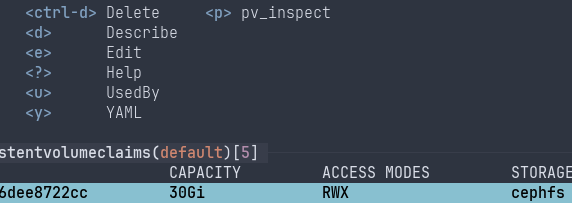

# pv_inspect

Mount a Kubernetes PersistentVolumeClaim volume on a new pod, shell into it, mount it (via SSHFS) if desired. Delete the pod when done.

## Installation

See the packages on the [releases page](https://github.com/cpg314/pv_inspect/releases).

Alternatively, compile with cargo:

```console
$ cargo install --git https://github.com/cpg314/pv_inspect
```

## Usage

```
Mount a PVC on a new pod, shell into it, and mount if (via SSHFS) if desired

Usage: pv_inspect [OPTIONS] [NAME]

Arguments:
  [NAME]  Name of the PVC to inspect

Options:
  -n, --namespace <NAMESPACE>    [default: default]
  -m, --mountpoint <MOUNTPOINT>
      --rw                       Mount the volume in read/write mode rather than read only
  -h, --help                     Print help
  -V, --version                  Print version
```

### As a `k9s` plugin

If you use the [k9s Kubernetes TUI](https://k9scli.io/), you can install `pv_inspect` as a plugin by editing your plugins configuration (see the output of `k9s info`) as follows:

```yaml
plugins:
  pv_inspect:
    shortCut: p
    description: pv_inspect
    scopes:
      - pvc
    command: pv_inspect
    args:
      - -n
      - $NAMESPACE
      - $NAME
```

When viewing `PersistentVolumeClaims`, the `p` key (or any other you might choose) will launch `pv_inspect`:


